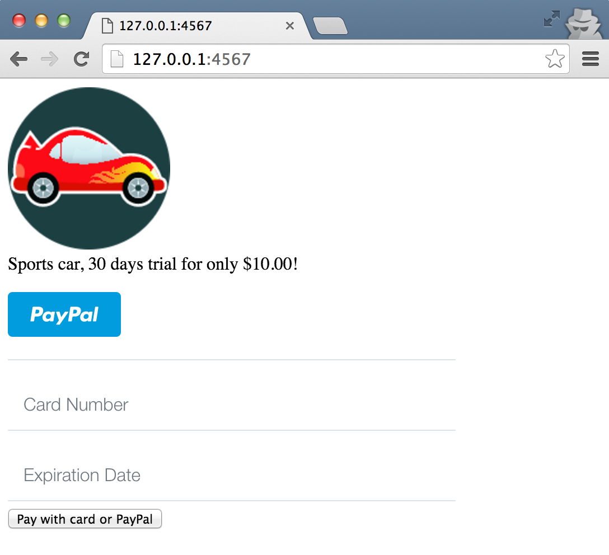
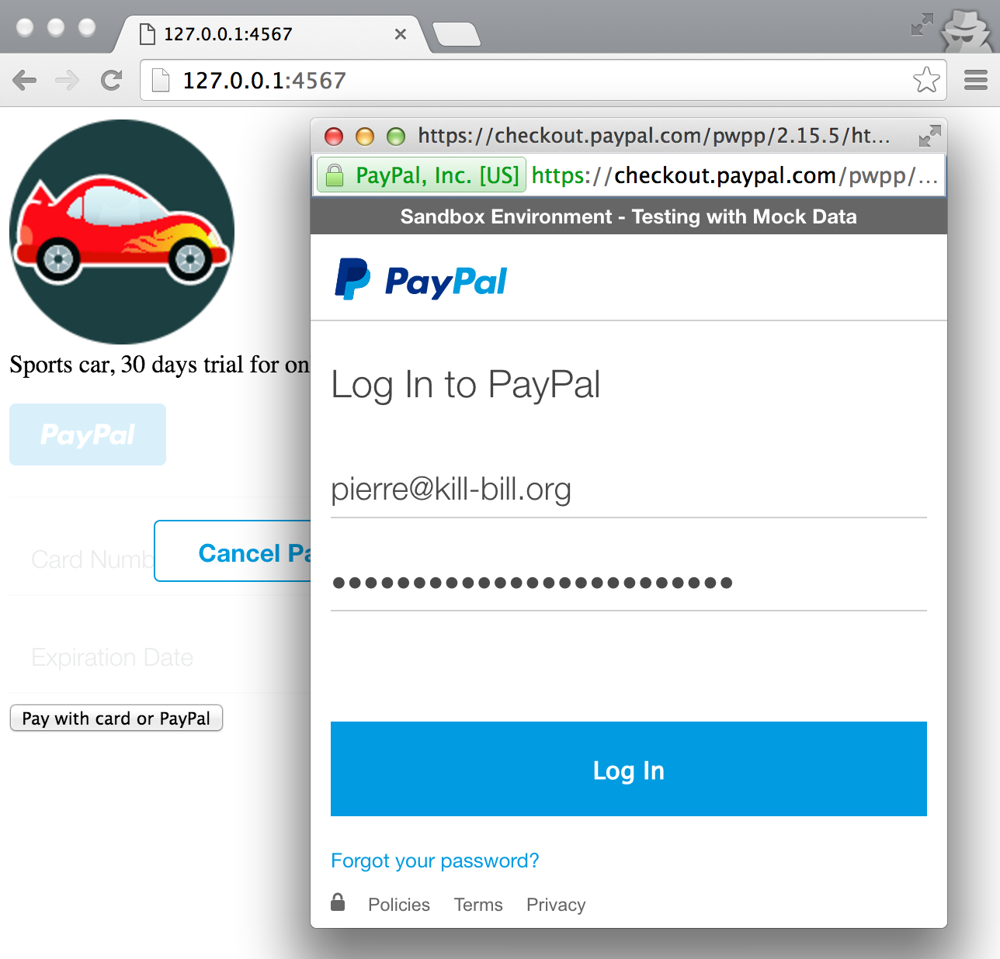

Kill Bill Braintree demo
========================

This sample app shows you how to integrate Braintree tokenization feature with [Kill Bill subscriptions APIs](http://docs.killbill.io/0.16/userguide_subscription.html).

Prerequisites
-------------

Ruby 2.1+ or JRuby 1.7.20+ is recommended. If you don’t have a Ruby installation yet, use [RVM](https://rvm.io/rvm/install):

```
gpg --keyserver hkp://keys.gnupg.net --recv-keys 409B6B1796C275462A1703113804BB82D39DC0E3
\curl -sSL https://get.rvm.io | bash -s stable --ruby
```

After following the post-installation instructions, you should have access to the ruby and gem executables.

Install the dependencies by running in this folder:

```
gem install bundler
bundle install
```

This also assumes Kill Bill is [running locally](http://docs.killbill.io/0.16/getting_started.html) at 127.0.0.1:8080 with the [Braintree plugin](https://github.com/killbill/killbill-braintree-blue-plugin) configured.

Run
---

To run the app:

```
ruby app.rb
```

then go to [http://localhost:4567/](http://localhost:4567/) where you should see the Braintree checkout UI.

Enter dummy data (for credit cards, 4111111111111111 as the card number and any expiry date in the future work) or log-in with your test PayPal account, and complete the checkout process.

This will:

* Tokenize the card or PayPal account in Braintree
* Create a new Kill Bill account
* Add a default payment method on this account associated with this token (a customer object is also created in Braintree, so the token can be re-used)
* Create a new subscription for the sports car monthly plan (with a $10 30-days trial)
* Charge the token for $10




