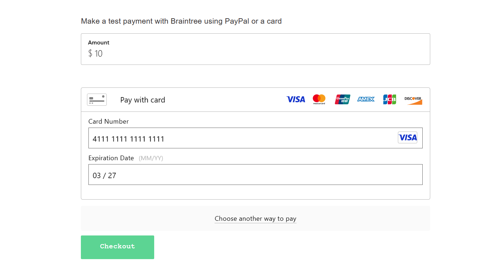
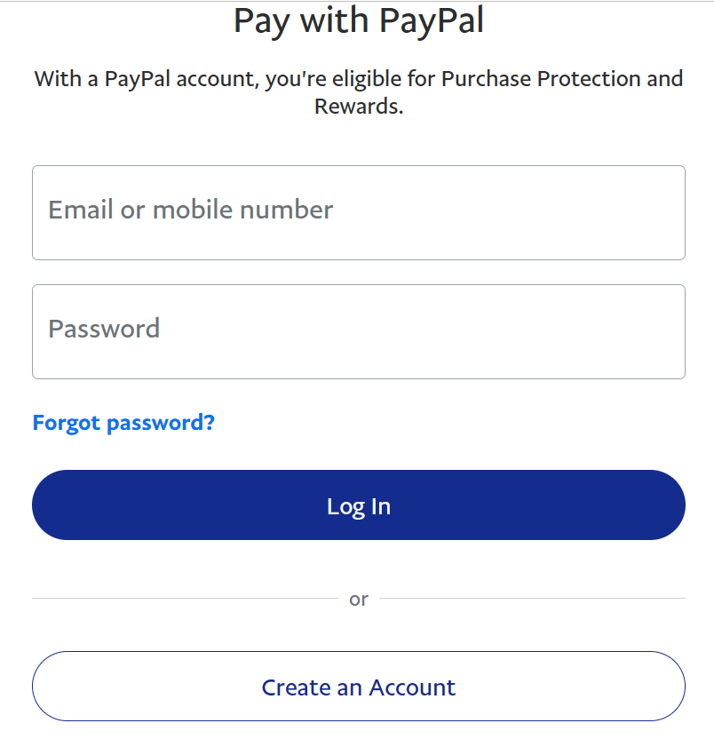
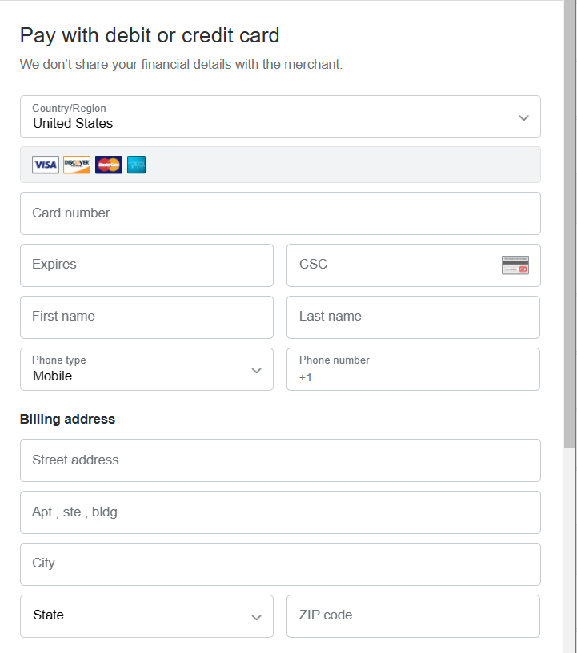
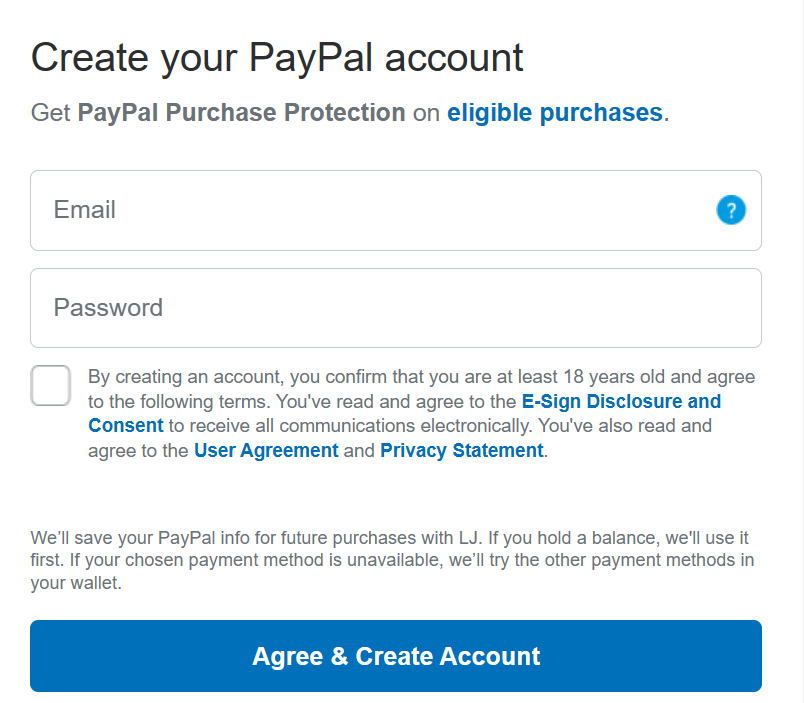
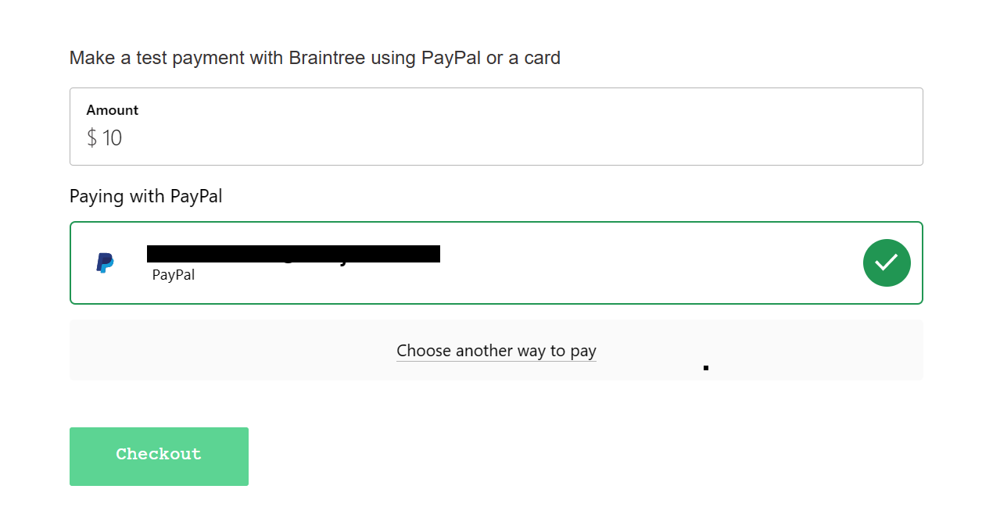

# Kill Bill Braintree Demo


Inspired from the [Braintree Drop-In implementation](https://developer.paypal.com/braintree/docs/start/drop-in).

## Prerequisites

* Kill Bill is [already setup](https://docs.killbill.io/latest/getting_started.html).
* The default tenant (bob/lazar) has been created.
* The [Braintree plugin](https://github.com/killbill/killbill-braintree) is installed and configured.

## Set up

* Obtain Braintree credentials as explained [here](https://github.com/killbill/killbill-braintree#configuration) and set the corresponding values in the [application.properties](https://github.com/killbill/killbill-braintree-demo/blob/0c8d38a300f32a38768b81584b4e7aa1fc5ba956/src/main/resources/application.properties) file.
* Create a Paypal sandbox account and link it to your Braintree sandbox account as explained [here](https://developer.paypal.com/braintree/docs/guides/paypal/testing-go-live/php#linked-paypal-testing). Note that this is required only for Paypal testing as explained [below](#with-paypal).


## Run

To run the app:

```
mvn spring-boot:run
```

## Test 


### With Card


1. Go to [http://localhost:8082/](http://localhost:8082/).
2. Enter amount as `20`. Click on **Card** and enter the following card details: 
  * Card Number: 4111111111111111
  * Expiry Date: 12/29
  
3. Click on **Checkout**:
4. This should display a successful payment page:

5. Verify that a new account is created in Kill Bill with a successful payment for the amount specified above.

### With Paypal

1. Go to [http://localhost:8082/](http://localhost:8082/).
2. Enter amount as `20`. Click on **PayPal**. Click the **PayPal Checkout** button.
3. The PayPal login screen is displayed. Click on the "Create Account" button at the bottom:
 
4. Enter the following details (Credit card details shown below are obtained via [PayPal Credit Card Generator](https://developer.paypal.com/api/rest/sandbox/card-testing/#link-creditcardgeneratorfortesting)):
  * Name: Jane Doe
  * Card Number: 4032032691996125
  * Exipry Date: 07/2028
  * CVV: 506
  * An address with a valid US zip code
  * A valid US phone number
 
5. Scroll to the bottom of the screen. Enter a valid email id and any password of your choice. Click the checkbox to agree to the terms and conditions and then click on the **Agree and Create Account** button:
 
6. If successful, the email id would be populated in the braintree demo screen. Click on **Checkout**:
 
4. This should display a successful payment page:

5. Verify that a new account is created in Kill Bill with a successful payment for the amount specified above.


## Credits

Based on the [Braintree Java Dropin Integration](https://github.com/braintree/braintree_spring_example).